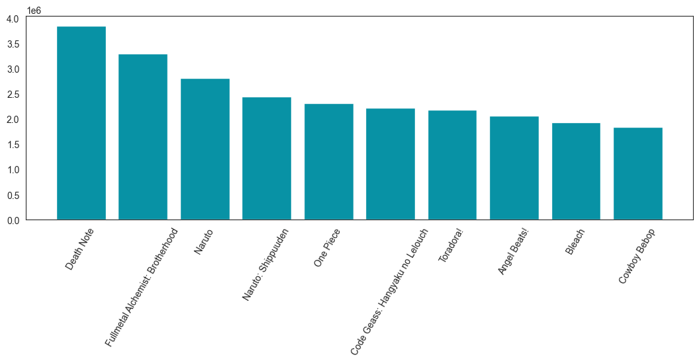

# Anime Growth Analysis
### Wirdin Rivera
#### Source: MyAnimeList.com - Top TV Series

## Introduction
By now, Anime has become a big thing on the media; we got great studios creating incredible content for us to enjoy, mangakas developing the most engagin stories that keep us hungry for more. In this project we will analyze such phenomenom, go deep on it's roots, see if we can find out a glimpse of it's trajectory and how we got here, so sit with me while we discover.

## Findings

### A discernible increase on titles emerges when examining the launch dates. Initially, anime didn't enjoy widespread popularity from 1960 to 1970, it did grow from the 1970s to the 1980s. but not by much. However, what it did not do is stop, the numbers kept going up as more studios started to be intrigued by this new topic. The numbers were steady from that point on up until the lates 1990s, where they almost -and then did- doubled past numbers, transforming the previously stable launch rate into a steadily rising phenomenon that we enjoy today.

### Let's see which titles were part of that.

### The reason is now evident; the period between 1995 and 2005 marked the emergence of exceptional animes that have maintained their popularity to this day. This era notably introduced what the majority of the community recognizes as "The Big Three" - Naruto, One Piece, and Bleach. It comes as no surprise that the number of anime series launched experienced a significant surge during and after this timeframe.

### Let's see how the launches have been doing this past decade.

### Now the overall distribution per month.

### The chart unmistakably reveals a recurring pattern: anime studios exhibit a tendency to launch their productions every three months, starting from January. However, a fascinating observation emerges when comparing the numbers between January and July, as well as between April and October—they share almost identical counts. This prompts the question: What could be the driving force behind this phenomenon? While one might attribute it to the changing seasons, it's noteworthy that January and July, as well as April and October, don't correspond to the same seasons. Perhaps the actual pattern unfolds every six months, and not our initial assumption of a three-month cycle.

### Interesting enough, our heatmap suggests a potential correlation between anime titles trending and peak release months traditionally favored by studios. This apparent pattern raises a good question: Does this reflect inherent quality differences in titles released during these specific months, or does the timing itself contribute to their success?

### Additionally, it's worth considering that the concentration of releases during the same period might also influence viewership. In other words, it might not be that these titles inherently perform exceptionally well, but rather that their collective presence during a specific timeframe contributes to their overall success as a group (month).

### We've witnessed substantial growth in the number of titles over the years and observed that many older titles continue to command a significant viewership. However, we've seen titles that have a lot of users/viewers, but at the same time are so far in the ranks that seems odd, so it begs the question: Is there a discernible connection between the year of release and the scores these titles receive? Are contemporary titles achieving higher scores compared to those released in the past?

### Anime titles released in 2005 and earlier show a not so impressive score of 6 and above, however, it remains almost the same in more recent years, we observe how clustered the points are on both sides of the 7 mark, both positively and negatively. Still, it's crucial to acknowledge that this shift may be influenced by the sheer volume of titles released in recent years, introducing potential unfairness on the results. To address this, we'll examine the record count for each decade and extract random samples to ensure a representative analysis.

### Initially, concerns about bias arose as modern years showed a greater volume of data compared to their predecessors, as we mentioned before, potentially skewing results in their favor and hindering an accurate representation. However, employing two types of sampling—proportionate (%/total) and disproportionate (150/decade)—yielded consistent outcomes. Consequently, we can confidently assert that, since the 1980s, there has been no discernible change in scores; contemporary titles continue to perform on par with their predecessors with a consistent median score of 7 from decade to decade, with occasional exceptions of lower-scoring titles that appear more frequentely in modern years. It's also worth noting that the commendable feat of consistently high scores for older titles stands as a noteworthy achievement in itself.

## Conclusion
### Undoubtedly, anime and related themes have firmly established their dominance in the realm of streaming media. What was once a subject of ridicule or mockery in the past has evolved into an inclusive and enjoyable experience that nearly everyone can embrace. The diversity and richness of content available for exploration have expanded significantly, as evidenced by the great titles we've encountered, such as Shingeki no Kyojin, Damon Slayer and Jujutsu Kaisen, to mention a few.

### Over the last decade, the emergence of exceptional titles has been noteworthy. Each passing day introduces new gems, initially presented as manga or manhwa, that later transform into captivating video titles. This continuous rush of creative narratives has the power to captivate fresh audiences, drawing them into this enchanting world. For many, anime has been a companion through growth, a source of learning, and a comforting space-an experience that is both entertaining and emotionally resonant, fostering a love for the art of animation.

### The trajectory of anime is one of continuous growth; we anticipate the arrival of new, outstanding titles, and as is customary, a fresh wave of fans will undoubtedly join this vibrant and ever-expanding community. The journey of anime's evolution is far from over, promising an exciting future for both seasoned enthusiasts and those yet to embark on this captivating journey.